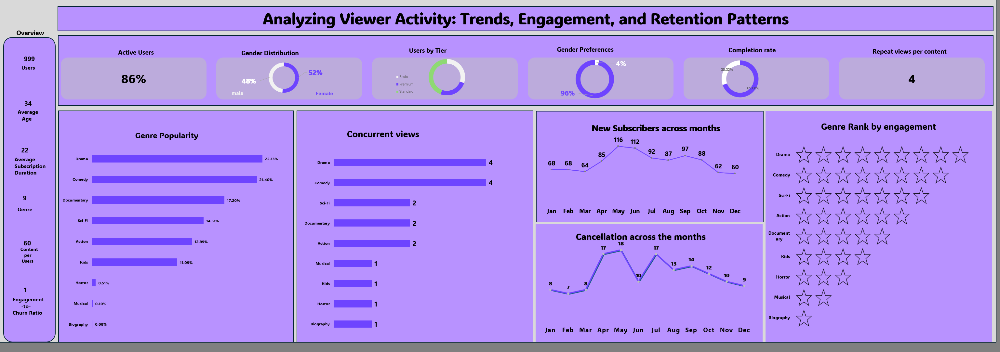

# Stream-Wave-Entertainment 🎬

A data analytics project examining Stream Wave Entertainment's viewer engagement,
retention patterns, and content performance across genres.

## Dashboard Preview

## Business Challenge
StreamWave operates in an increasingly competitive streaming market. 
Despite a library of **9 content genres** served to **999 users**, 
executives face pressure to allocate budgets to genres that truly 
drive engagement, retention, and subscriber growth.

Key obstacles addressed:
- Fragmented viewership with **Drama dominating at 33%** vs 
  **Biography at just 0.08%**
- Rising content production and licensing costs
- Subscriber churn due to poor content recommendations, with 
  **cancellations peaking at 18 in a single month**
- Competitive pressure from niche streaming rivals with only 
  **1 engagement-to-churn ratio**

## Project Objective
To solve StreamWave's content investment challenge, I:

- Imported and cleaned raw data across **999 users** and their 
  viewing activity using Power Query
- Built pivot tables to calculate KPIs such as completion rates, 
  repeat viewership, and churn correlations
- Analysed genre engagement patterns across **9 content genres**
- Ranked all genres by engagement, retention, and repeat viewership
- Delivered an interactive executive dashboard to guide content 
  investment decisions for stakeholders

## Tools Used
| Tool | Purpose |
|------|---------|
| Microsoft Excel | Data cleaning, analysis, and dashboard |
| Power Query | Data transformation and shaping |
| Excalidraw | Project planning and workflow design |
| Color Extract | Dashboard colour theming |

## Project Scope
1. **Data Preparation** — Imported CSVs, removed duplicates, handled 
   missing values, standardized genre names
2. **Pivot Tables** — Summarized total watch hours by genre
3. **Genre Engagement Metrics** — Calculated completion rates and 
   repeat viewership per genre
4. **Subscriber Retention Analysis** — Cross-tabulated genres with 
   subscription status (renewed vs cancelled)
5. **Visualization** — Bar charts and line charts for monthly trends
6. **Insights & Recommendations** — Ranked genres by engagement, 
   retention, and repeat viewership
7. **Executive Dashboard** — Built an interactive Excel dashboard 
   with slicers for decision-makers

## Key Findings
- 🟣 **Drama (33%) and Comedy (21%)** are the top performing genres
- 👥 **86% active users** with 52% female and 48% male split
- 📅 **Subscriber peak** in July–August (116 and 112 new subscribers)
- 🔄 **Average repeat views** of 4 per content item
- ⚠️ **Horror, Musical, and Biography** have the lowest engagement
- 📉 **Cancellations peaked mid-year**, indicating seasonal churn risk

## Dataset Overview
| Sheet | Description |
|-------|-------------|
| subscriptions | Subscription records and plan tiers |
| users | User demographics and activity |
| viewing_activity | Content viewing behaviour |
| KPI & Pivot Tables | Calculated metrics and summaries |
| Summary | Key insights overview |
| REPORT | Interactive executive dashboard |

## Expected Outcome
A strategic framework enabling StreamWave to optimize content investment, 
reduce churn, improve content recommendations, and enhance user satisfaction 
and retention rates.

## Skills Demonstrated
- Data cleaning and transformation with Power Query
- KPI development and pivot table analysis
- Dashboard design and data visualization
- Business insight generation from viewer behaviour data
